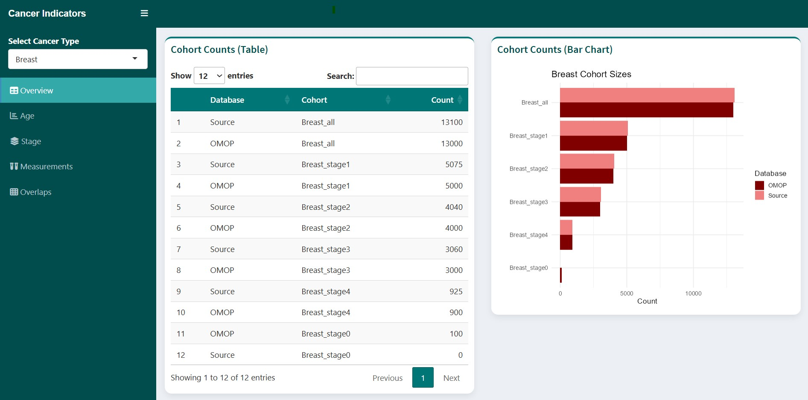

# OMOP Cancer Indicators

**OMOPCancerIndicators** is an R package for automated generation, and analysis of cancer cohorts and indicators from OMOP CDM databases.  

This package facilitates reproducible cancer cohort creation, including **stage-specific cohorts, measurement-based subcohorts**, and comprehensive cohort summarization (counts, overlaps, age distributions, stage, receptor status, and measurement positivity). These results can be compared to counts from the source data to validate the data conversion and visualized in a Shiny app.

---

## Features

- Generate **(multi) cancer cohorts** directly from **JSON configuration files**:
  - Cancer diagnosis concept IDs
  - Staging information (general, clinical, pathological)
  - User-defined measurement categories
- Create **subcohorts** based on stage or measurement results
- Summarize cohort counts with descriptive names
- Compute **pairwise overlaps** between cohorts
- Summarize **age distribution** in conventional 10-year bins
- Summarize **cancer stage distribution** including missing/unknown stages
- Summarize **receptor and measurement positivity**, including unknowns
- Compatible with OHDSI `CohortGenerator`, `DatabaseConnector` and `SqlRender` for PostgreSQL, SQL Server, and other OMOP-supported databases

---

## 🔹 Folder Structure

```
OMOPCancerIndicators/
├── R/
│   ├── AnalyzeCohorts.R
|   ├── CreateCancerCohorts.R
│   ├── RunCohortGeneration.R
│   ├── RunCohortDiagnostics.R
|   ├── RunDiagnostics.R
│   └── RunStudy.R
├── inst/
│   ├── cohorts/
│   |   ├── json/
│   |   ├── sql/
│   |   └── settings/
|   ├── settings/
│   |   ├── cancer_diagnosis.json
│   |   ├── cancer_stages.json
│   |   └── measurements.json
|   └── shiny/
├── extras/
│   └── codeToRun.R
├── man/
├── DESCRIPTION
├── NAMESPACE
└── README.md
```

---

## Installation

Clone the repository or download the zip folder, extract it in the file location and then install the package using devtools. This allows you to make changes directly without reinstalling the package. If you edit the script, do not forget to call `devtools::load_all()` first, otherwise the changes are not loaded.

```r
# Install devtools if not already installed
install.packages("devtools")

# Install package from local folder
devtools::install("path/to/OMOPCancerIndicators")
```
---

## Usage
Once the package is installed, open the `extras/CodeToRun.R` and modify the connectionDetails, cdmDatabaseSchema and CohortDatabaseSchema if needed. Run this file and inspect the results in the Shiny app.

**Disclaimer:** The package has only been tested on a PostgreSQL and SQL server database.

### Customization and usage of individual functions
#### 1. Configuration Files

The concepts that are included in the analyses are stored in individual JSON files. These can be extended or modified if different concepts are used in your database

**cancer_diagnosis.json**
The ancestor concept for primary malignant breast cancer is included, meaning that all descendants are included. The list of excluded concepts are a one to one match (so no descendants) and these are excluded from the selection. New cancer types can be added to the JSON file, see example below:

```json
{
  "Breast": {
    "included": [4112853],
    "excluded": [44500370, 4301516, 36543333, 36564967, 36403034, 36403041, 36403047, 36403017, 
            4001315, 4001670, 36403027, 36403064, 36403075, 36517431, 36529758, 36537608, 36546703, 
            36557659, 36717217, 42512152, 42512201, 44499447, 44499563, 44499751, 44500653, 44501092, 
            44501151, 44501152, 44501276, 44501353, 44501356, 44501446, 44501633, 44501854, 44501955, 44501957, 
            44502178, 44502714, 44502954, 44503030, 44503556]
  },
  "Ovary": {
    "included": [200051,4181351],
    "excluded": []
  }
}
```
**cancer_stages.json** 
The configuration file is organised so that different staging measurements can be used for different cancer diagnoses (as defined in the `cancer_diagnosis.json` file). The cancer type a measurements applies to should be listed under `applies_to`. A simplified example can be found below. Any concept, including any descendants, that is listed under 'included' will used to find records. If there are any descendants of the 'included' concept that need to be excluded, you can list them under 'excluded' (these concepts include all their descendants automatically), otherwise you can leave this blank (`[]`). For the NCR, the general stage is what is included and the specific pathological and clinical stages are excluded to avoid multiple records to be created per person. This may need to be adjusted if the logic is different in other databases.

```json
{
  "AJCC": {
        "included": {
            "stage0": [1633754]
    },
        "excluded": {
          "stage0": [1634502, 1633542]
    },
    "applies_to": ["Breast"]
  },
  "FIGO": {
    "included": {
        "stage0": [1634564]
    },
    "excluded": {
      "stage0": []
    },
    "applies_to": ["Ovary"]
  }
}

```
**measurements.json**
Other measurements than staging, can be listed in the measurements.json configuration file. At the moment, two types of measurements are accounted for: 1) type of measurement in concept_id (e.g. ER) and each value that measurement can take listed as an individual item in the json file (e.g. positive). This is the value_as_concept_id. 2) There is no overarching measurement, each value is listed individually (e.g. BRCA1 mutation, without a value_as_concept_id). For comparison and visualization purposes, these measurements can be grouped together, e.g. 'BRCA mutation'.

The configuration file is organised so that particular measurements can be specifically used for different cancer diagnoses (as defined in the `cancer_diagnosis.json` file). The cancer type a measurements applies to should be listed under `applies_to`.

```json
{
  "ER": {
    "concept_id": [35917793, 35918406],
    "Positive": [35935003, 35919678],
    "Negative": [35930764,35919055],
    "applies_to": ["Breast"]
  },
  "BRCA_mutation": {
    "BRCA1": [4135410],
    "BRCA2": [4135411],
    "No_BRCA1": [4136450],
    "No_BRCA2": [4133516],
    "applies_to": ["Ovary"]
  }
}
```

#### 2. Generate Cancer Cohorts
```r
library(OMOPCancerIndicators)
cohorts <- createCancerCohorts(
  cdmDatabaseSchema = "omopcdm",
  cohortDatabaseSchema = "results",
  cohortTable = "cancer_cohorts",
  year = 2019,
  gender = 8532,
  diagnosis_config = "inst/settings/cancer_diagnosis.json",
  stage_config = "inst/settings/cancer_stages.json",
  measurement_config = "inst/settings/measurements.json",
  windowDays = 30,
  startCohortId = 1
)
```

#### 3. Run Cohort Generation
```r
runCohortGeneration(
  connectionDetails = connectionDetails,
  cdmDatabaseSchema = "omopcdm",
  cohortDatabaseSchema = "results",
  cohorts = cohorts,
  cohortTable = "cancer_cohorts",
  cohortDefinitionSet = cohorts$cohortDefinitionSet
)
```

#### 4. Generate a lookup table for the created cohorts
```r
lookup <- generateCohortLookup(
  cohorts$cohortDefinitionSet
  )
```

#### 4. Summarize Cohorts
```r
counts <- summarizeCohortCounts(
  connectionDetails,
  cohortDatabaseSchema = "results",
  cohortTable = "cancer_cohorts",
  lookup = lookup
)
overlaps <- summarizeOverlap(
  connectionDetails,
  cohortDatabaseSchema = "results",
  cohortTable = "cancer_cohorts",
  lookup = lookup
)
age_summary <- summarizeAgeDistribution(
  connectionDetails,
  cdmDatabaseSchema = "omopcdm",
  cohortDatabaseSchema = "results",
  cohortTable = "cancer_cohorts",
  cohortDefinitionSet = cohorts$cohortDefinitionSet
  lookup = lookup,
  ageBinSize = 10,
  collapseOldestAge = FALSE
)
stage_summary <- summarizeStageDistribution(counts)
measurement_summary <- summarizeMeasurements(counts)
```

---

## Output

The main outputs saved in the Results/ folder. 

- The **OMOP analysis** is saved to the Results/omop folder:
  - cohortcounts_omop.csv
  - overlaps_omop.csv
  - ageDistribution_omop.csv
  - stage_omop.csv
  - measurements_omop.csv
- The **source data** needs to be added manually to the Results/source folder. This folder already contains the template files with counts set to 0 (as a placeholder). Update these counts to compare the OMOP extraction with your source data. In case modifications are made to the cohort structure, the structure of these files may need to adjusted to match the OMOP generated results.
  - cohortcounts_source.csv
  - ageDistribution_source.csv
  - stage_source.csv
  - measurements_source.csv


## Visualization

The results can be visualized using the Shiny app. 




## License

This project is licensed under the MIT License. 

## Contact

For questions:  
**Maaike van Swieten**  
📧 m.vanswieten@iknl.nl
🔗 GitHub: [MaaikevS](https://github.com/MaaikevS)
